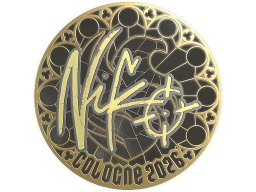

<div align="center">
  
</div>

<br/>

<div align="center">
  
</div>

<br/>

---

## 🤖 About Me


- 🎓 **M1 Student** @ University of Tokyo
- 🏛️ Grad. School of Information Science and Technology
- ⚙️ Dept. of Mechano-Informatics
- 🔬 Dynamic Control System Lab
- 🌐 [jzkosann.github.io](https://jzkosann.github.io/)

### 🦾 Currently working on :
- [x] ⚙️ Model Predictive Control (MPC / acados)
- [ ] 🧠 Learning-based motion planning
- [ ] 🚀 Sim-to-real transfer with IsaacLab → ROS2


### 🎮 Outside the lab :


- 🕵️ Investigating suspicious bugs
- 🎮 Counter-Strike 2 &nbsp;

<br clear="right"/>

---

## 👨‍💻 Languages & Tools

<div align="center">

**Languages**


<br/>

**Tools & Frameworks**


<br/>


</div>

---

## 📬 Contact Me

<p>
If you're into robotics, control systems, or just want to talk — feel free to reach out!
</p>

<a href="mailto:hong-jinzhong@ynl.t.u-tokyo.ac.jp">
  
</a>
<a href="https://github.com/jzkosann">
  
</a>
<a href="https://jzkosann.github.io/">
  
</a>

---

## 📊 GitHub Stats

<div align="center">
  
  
</div>

<br/>

<div align="center">
  
</div>

---

<div align="center">

```
  // case closed. for now.
```


</div>
