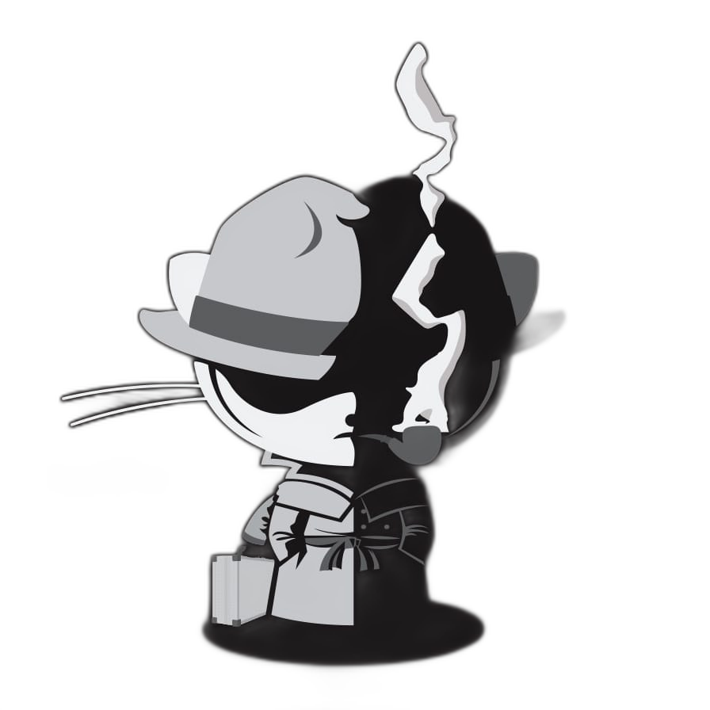

<div align="center">
  
</div>

<div align="center">
  <a href="https://jzkosann.github.io/">
    
  </a>
</div>

<br/>

<div align="center">

[](https://jzkosann.github.io/)
[](mailto:jinzkosann@gmail.com)
[](https://github.com/jzkosann)

</div>

---

<table border="0" cellspacing="0" cellpadding="0">
<tr>
<td valign="top" width="68%">

### `> whoami`

```yaml
name       : JinZ
role       : Master's Student (M1)
university : Grad. School of IST, UTokyo
dept       : Department of Mechano-Informatics
lab        : Dynamic Control System Lab
interests  : [ Robotics, Control Theory, ML ]
status     : investigating...
```

</td>
<td valign="bottom" align="right" width="32%">
  
</td>
</tr>
</table>

---

### `> cat tech_stack.txt`

<div align="center">

**Languages**


**Tools & Frameworks**


</div>

---

### `> ./stats --all`

<div align="center">
  
  
</div>

<div align="center">
  
</div>

<br/>

<div align="center">
  
</div>

---

<div align="center">

```
  // case closed. for now.
```


</div>
